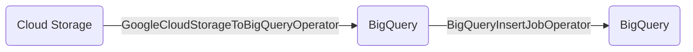

# TL;DR

A simple Cloud Composer Airflow DAG _(Directed Acyclic Graph)_ that moves Parquet files from Google Cloud Storage into BigQuery. This repo can be used as a deployment template for Cloud Composer via GitHub Actions. It also acts as a Dataplex Data Lineage demo.

# Overview

The DAG included in the `/dags` folder simulate a typical ELT workflow. Distributed Parquet files in GCS are first loaded into BigQuery using the [GoogleCloudStorageToBigQueryOperator](https://airflow.apache.org/docs/apache-airflow/1.10.13/_api/airflow/contrib/operators/gcs_to_bq/index.html) Airflow Operator. This operator ingests the files into BigQuery and applies a Schema passed via the `schema_fields` parameter. See diagram below.



Next a the data is aggregated and loaded into a new table using a CTAS operation. This is accomplished using the [BigQueryInsertJobOperator](https://airflow.apache.org/docs/apache-airflow-providers-google/stable/operators/cloud/bigquery.html#execute-bigquery-jobs) Airflow operator.

# Setup

This project includes a yaml file for deployment to Google Cloud using Github Actions. The Github Action Workflow requires an _"Action Secret"_ used to set environment variables during deployment. Set the following secrets in the repository before deployment.

| Action Secret | Value                                                          |
| ------------- | -------------------------------------------------------------- |
| GCP_SA_KEY    | Service Account Key used to authenticate GitHub to GCP Project |

The deployment yaml file found in `/.github/workflows/` defines the setup in two stages; a build stage followed by a deploy stage. These stages are described in detail below:

1. Build
   > - Authentication with GCP - [auth](https://github.com/google-github-actions/auth)
   > - Upload DAG folder as repository artifact - [upload-artifact](https://github.com/actions/upload-artifact)
   > - Upload repository artifact to Cloud Storage - [upload-cloud-storage](https://github.com/google-github-actions/upload-cloud-storage)
2. Deploy
   > - Authentication with GCP - [auth](https://github.com/google-github-actions/auth)
   > - Setup Google Cloud SDK - [setup-gcloud](https://github.com/google-github-actions/setup-gcloud)
   > - Deploy Cloud Composer SDK

## Data Lineage

The following shell script must be executed in the destination project to enable Data Lineage. More info [here](https://cloud.google.com/composer/docs/composer-2/lineage-integration#enable-integration)

```shell
gcloud beta composer environments update etl-orchestration-pool \
    --location us-central1 \
    --enable-cloud-data-lineage-integration
```
