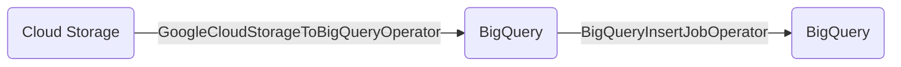

# TL;DR

A simple Cloud Composer Airflow DAG _(Directed Acyclic Graph)_ that moves Parquet files from Google Cloud Storage into BigQuery. This repo can be used as a deployment template for Cloud Composer via GitHub actions. It also acts as a Dataplex Data Lineage demo.

# Overview

The DAG included in the `/dags` folder simulate a typical ELT workflow. Distributed Parquet files in GCS are first ingested into BigQuery using the [GoogleCloudStorageToBigQueryOperator](https://airflow.apache.org/docs/apache-airflow/1.10.13/_api/airflow/contrib/operators/gcs_to_bq/index.html) operator. This operator loads the Parquet files into BigQuery and applied the Schema passed via the `schema_fields` parameter. See diagram below.



Next a the data is aggregated and loaded into a new table using a CTAS operation. This is accomplished using the [BigQueryInsertJobOperator](https://airflow.apache.org/docs/apache-airflow-providers-google/stable/operators/cloud/bigquery.html#execute-bigquery-jobs) Airflow operator.

```shell
gcloud beta composer environments update etl-orchestration-pool \
    --location us-central1 \
    --enable-cloud-data-lineage-integration
```

## Deployment

```shell
gcloud composer environments storage dags import \
          --environment etl-orchestration-pool \
          --location us-central1 \
          --source gs://cf-cloud-composer-dags/dags/gcs-bq.py"
```
